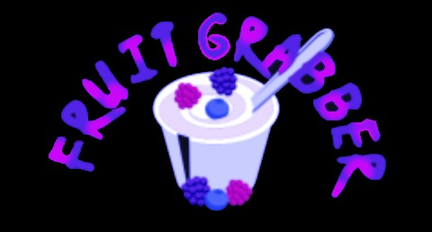

# Final Project

Read [this document](https://cliutils.gitlab.io/modern-cmake/chapters/basics/structure.html) to understand the project
layout.

**Author**: Chirag Gupta - [`chiragg4@illinois.edu`](mailto:chiragg4@illinois.edu)
# FruitGrabber

An exciting game which uses Computer Vision

Hold a green container in front of the webcam and start catching fruits !!!

## System Specs
- Needs a Mac OS computer capable of running 60 fps with a working webcam and atleast 4 core processor.

## Dependencies
- Cmake
- Cinder
- OpenCV

## OpenCV
- This game needs the OpenCV library which can be downloaded [here](opencv.org):

## Controls
### Game
#### Keyboard

| Key       | Action                                                      |
|---------- |-------------------------------------------------------------|
| `return`  | Starts the game                                             |
| `p`       | Toggle game pause                                           |
                                  
